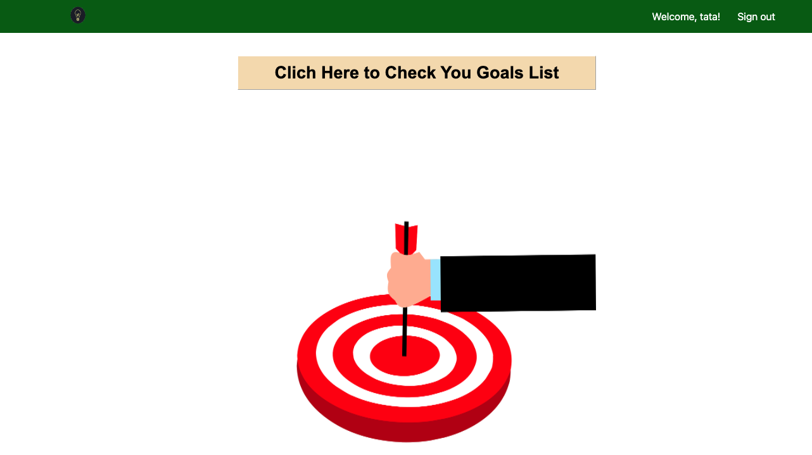

# Goals Track Application

# Goal Track Application Introduction
This application is designed to help users effectively track their goals. It enables users to set, manage, and monitor their goals across various aspects of their lives, including work, study, fitness, and travel.

# webpage 
* [Heroku deployment](https://nani-app-bada8d1b7e82.herokuapp.com/)
* [Application planning](https://trello.com/b/jk9kkcgq/unit-2-project-planning)

# Attributions
* pixabay wardencat -- My web icon is from pixabay wardencat（https://pixabay.com/zh/illustrations/light-icon-badge-2692347/）
* pixabay Peggy_Marco--My Home page image is from pixabay Peggy_Marco（https://pixabay.com/zh/illustrations/direction-path-decision-goal-2320124/）
* pixabay Mohamed_hassan_ My Home page image is from pixabay Mohamed_hassan（https://pixabay.com/zh/vectors/target-achievement-goal-focus-7699762/ ）

# Technologies Used

 

# Next Steps:
* On the goal list page, add category tags. For example, if the user selects "travel," only the content related to travel should be displayed in the table.
*  On the goal list page, On the goal list page, add a sorting feature by date. Goals should be able to be sorted in ascending or descending order based on the start date.
